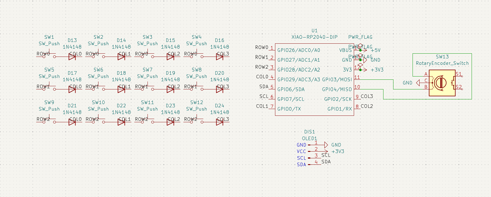
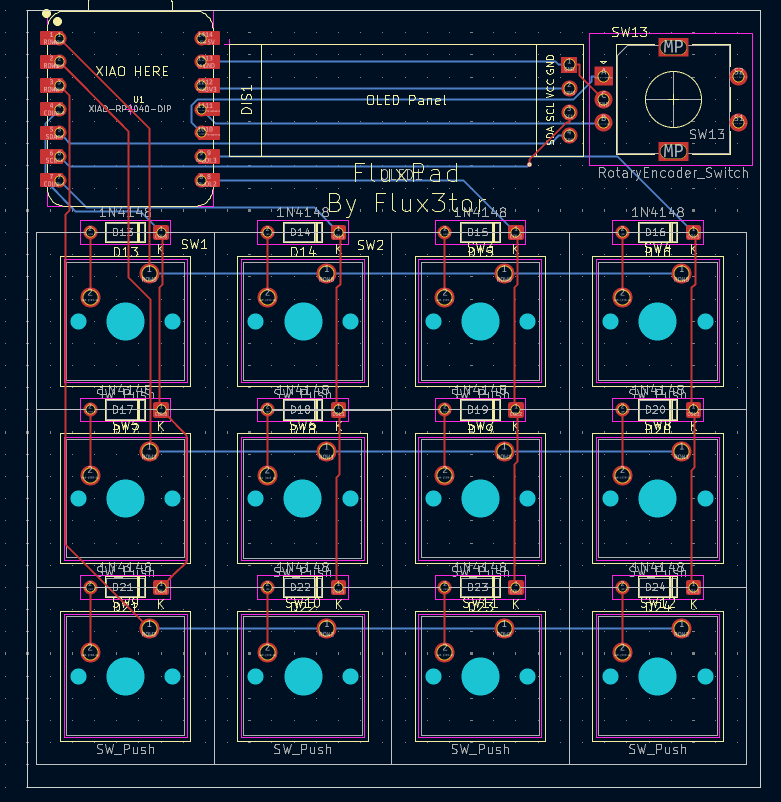
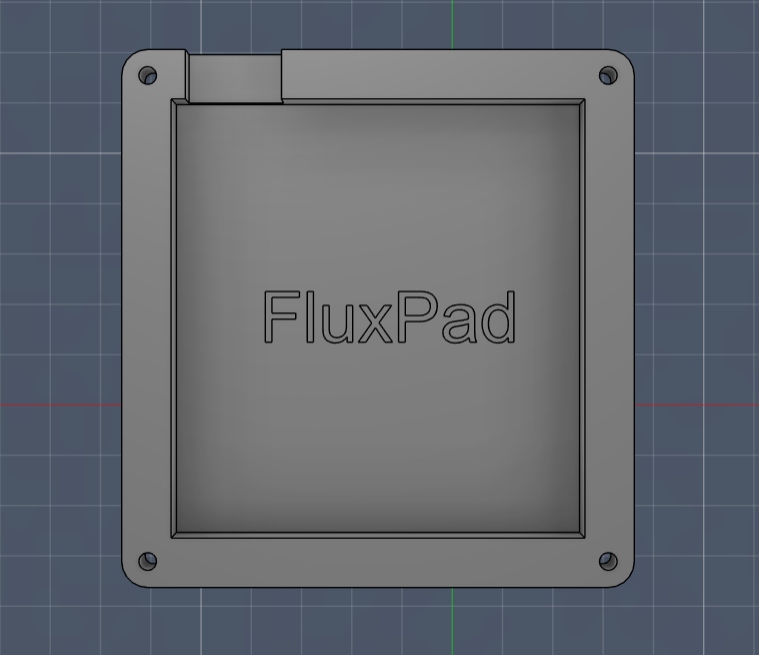
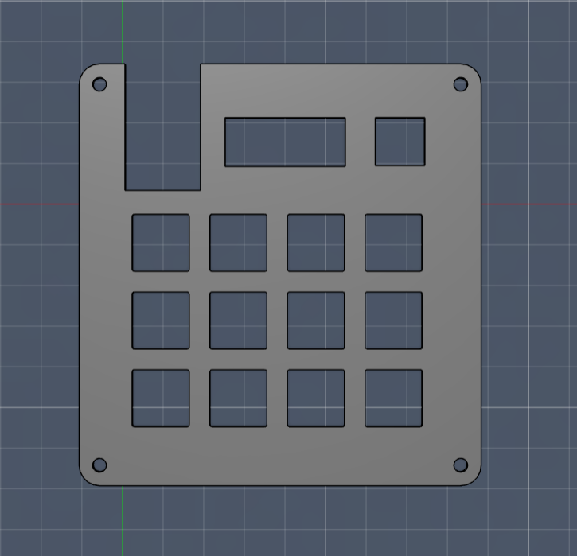
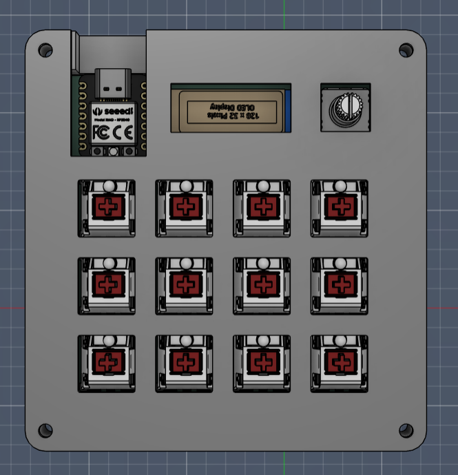
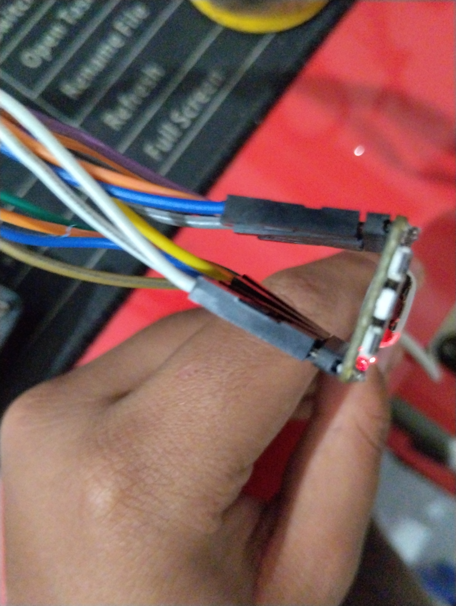

# FluxPad

FluxPad is a custom 12-key macropad powered by the Seeed XIAO RP2040.  
It features a rotary encoder for volume and scrolling, an OLED status display, and a compact 3D-printed case designed for daily productivity and creative workflows.

---

## Features
- 12 MX mechanical keys
- Rotary encoder (volume + scroll control)
- 0.91" OLED display (layer & status display)
- Seeed XIAO RP2040 microcontroller
- QMK firmware
- Fully custom 2-layer PCB
- 3D-printed case

---

## Project Images

### Schematic

### PCB

### Case Design
#### Bottom Case

#### Top Case

### Final Layout

---

## System Overview

### MCU
- Seeed Studio XIAO RP2040 (Through-hole)

### Inputs
- 12x MX mechanical switches
- 1x EC11 rotary encoder

### Output
- 0.91" OLED display (I2C)

---

## Pin Mapping

| Function | GPIO |
|----------|------|
| ROW0 | GPIO26 |
| ROW1 | GPIO27 |
| ROW2 | GPIO28 |
| COL0 | GPIO29 |
| COL1 | GPIO0 |
| COL2 | GPIO1 |
| COL3 | GPIO2 |
| Encoder A | GPIO4 |
| Encoder B | GPIO3 |
| OLED SDA | GPIO6 |
| OLED SCL | GPIO7 |

---

## Bill of Materials (BOM)

| Part | Quantity | Manufacturer | Part Number |
|------|----------|--------------|-------------|
| Seeed XIAO RP2040 (TH) | 1 | Seeed Studio | 102010428 |
| MX Mechanical Switch | 12 | Gateron / Kailh | MX-Style |
| 1N4148 Diodes (TH) | 12 | Vishay | 1N4148 |
| EC11 Rotary Encoder | 1 | ALPS / Generic | EC11 |
| 0.91" OLED Display | 1 | Generic | SSD1306 |
| DSA Keycaps | 12 | Generic | DSA Blank |
| M3x16 Screws | 4 | Generic | M3 |
| Heatset Inserts | 4 | Generic | M3 |

---

## Firmware
FluxPad runs on QMK.  
The firmware supports:
- Key matrix scanning
- OLED display support

Source code is located in the `Firmware/` folder.

---

## Case
The case is fully 3D printed and designed in Fusion360.  
It consists of:
- Bottom shell
- Top plate
- Heatset insert mounts

Exported as three STEP files in the `CAD/` folder.

---

## Build Process

This was my first time soldering, and I ran into a few issues along the way.

While soldering the XIAO RP2040 headers, I accidentally bent the pins without realizing. Instead of redoing everything, I fixed it by using ribbon wires to connect the headers to the PCB. It doesn't look perfect, but it works reliably.

Soldering the full PCB took around 5 hours.

### Firmware Issues

Initially, I used KMK firmware, but it kept crashing when I added OLED support. To debug, I tested the OLED separately using Arduino IDE and confirmed it was working.

I then switched to QMK and rewrote the firmware from scratch, which took another ~5 hours. After that, everything worked properly, including the OLED and encoder.

---

## Final Build

  

---

## Demo Video

[Watch FluxPad Demo](https://drive.google.com/file/d/1hNpVQt3ci1zXDI4beTaH4Mk9EOGyLXIW/view?usp=drive_link)

---

## Result

The final FluxPad works as intended:
- All 12 keys function correctly  
- Rotary encoder works for control  
- OLED display works  

It may not look perfect due to manual fixes, but it is fully functional and used daily.

---

## Author
Designed and built by **Flux3tor**  
Hack Club Hackpad Project
